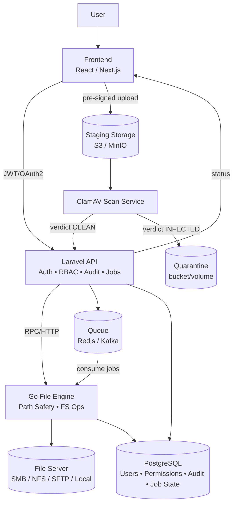

# Server File Manager Platform (Laravel + Go File Engine)

A web-based file management platform that operates on a **server-side filesystem** (SMB/NFS/SFTP/local). The platform is designed with: RBAC, auditability, malware scanning, and strict path controls.

> [!Note]
> **Project status:** In active development. This repository documents an evolving architecture.

---

## Why this exists

Many organizations still rely on direct file server access (SSH/FTP/shared drives) to create folders, upload documents, and manage structured storage. This approach is:
- hard to audit,
- easy to misuse (path traversal, unauthorized access),
- inconsistent with compliance requirements,
- operationally fragile.

This platform provides a centralized, permissioned interface that **controls and records every filesystem mutation**.

---

## What it does

- **Explore folders** (tree navigation, directory listing)
- **Create folders** with enforced naming conventions
- **Upload files** securely (type/size policies + malware scanning)
- **Enforce access controls** (RBAC + per-path permissions)
- **Audit everything** (who/what/when/where)

---

## High-level architecture

- **Frontend:** React / Next.js
- **API / Orchestrator:** PHP (Laravel) for auth, RBAC, business rules, audit logging
- **File Engine:** Go microservice for filesystem operations and concurrency
- **Database:** PostgreSQL for users, permissions, audit trails, job/state tracking
- **Queue:** Redis for asynchronous operations (folder creation, upload finalization)
- **Anti-malware:** ClamAV scanning before committing files to the final location
- **Temporary Upload Storage:** S3/MinIO (or a hardened local staging area)

### Architecture Diagram



### Design Tradeoffs

#### Why split PHP + Go?

- Pros
  - Laravel accelerates delivery of auth/RBAC/auditing with mature patterns (Policies, middleware).
  - Go is a better fit for concurrency-heavy filesystem I/O, safer path handling, and predictable performance.
  - Independent scaling: API and workers can scale separately.

- Cons
  - Two languages increase build/test complexity and raise the bar for onboarding.
  - Cross-service debugging is harder without strong correlation IDs + tracing.
  - Requires a strict contract to avoid “authorization drift” between services.

#### Why async jobs for mutations?

- Pros
  - Prevents API timeouts when the filesystem is slow or busy.
  - Enables retries, DLQ handling, and controlled concurrency.
  - Makes the system resilient under load spikes.

- Cons
  - Introduces eventual consistency: UI must handle pending/running states.
  - Requires idempotency keys to prevent duplicate operations.

#### Why staging uploads + ClamAV gate?

- Pros
  - Malware never reaches the final filesystem unless clean.
  - Protects file servers from direct upload load and partial writes.
  - Enables quarantine and security audit events.

- Cons
  - Additional operational components (object storage, scanner pool).
  - Scan throughput can become a bottleneck without limits and scaling.

#### Queue choice (Redis vs Kafka)

- Redis is simpler for early stages; Kafka becomes attractive for high-scale event streaming and replay.
- The architecture supports both, but production should standardize on one primary mechanism per environment.

---

## Known architectural weaknesses (current state)

This repository is explicit about gaps and risks so reviewers understand where maturity work is focused.

### 1) Filesystem scalability & bottlenecks

**Risk:** SMB/NFS/SFTP have non-linear performance under concurrency, lock contention, and variable latency.  
**Mitigation plan:** Introduce:
- queue governance (rate limits, backpressure, DLQ),
- concurrency controls per share/path,
- performance SLOs and stress tests,
- eventual sharding across file servers (future phase).

### 2) Trust boundary clarity between API and File Engine

**Risk:** Authorization bypass or drift if Laravel and Go disagree on “who can do what”.  
**Mitigation plan:** Define a single source of truth:
- Laravel authorizes business intent,
- Go validates **filesystem-safe execution** (root constraints, canonicalization, allowlists),
- service-to-service auth (mTLS + scoped tokens),
- idempotent job model with strong auditing.

### 3) Async state model is implied, not formalized

**Risk:** Users see inconsistent outcomes without clear job states.  
**Mitigation plan:** Introduce explicit states:
- `PENDING → RUNNING → SUCCEEDED | FAILED | QUARANTINED`
- user-visible job tracking and retry semantics
- idempotency keys to prevent duplicate operations.

### 4) Security hardening is designed, but not fully enforced yet

**Risk:** Path traversal, malware handling, secrets management, and transport security can be incomplete during early development.  
**Mitigation plan:** Lock in controls early:
- canonical path sanitization and root jail,
- strict MIME/type allowlists and size caps,
- malware scan gating + quarantine,
- secrets via Vault/KMS/SSM,
- mTLS and least-privilege service accounts.

---

## Roadmap

- **Phase 1 — Core:** Auth, browse directories, permissioned read access
- **Phase 2 — Basic mutations:** Folder creation, basic upload, audit logging
- **Phase 3 — Security & scale:** ClamAV gating, queues, retry/DLQ, observability
- **Phase 4 — Advanced governance:** Fine-grained ACL, notifications, workflow automation
- **Phase 5 — Enterprise features:** Versioning, retention policies, eDiscovery-friendly audit

---

## Documentation map

- `docs/architecture/README.md` — Platform architecture (components, flows, contracts)
- `docs/readmes/contributors.md` — Dev setup, local environment, contribution workflow
- `docs/readmes/platform-engineers.md` — Deployment, operations, monitoring, scaling
- `docs/readmes/security-reviewers.md` — Security controls, threat model, verification
- `docs/adr/` — Architectural Decision Records (locked design decisions)

---

## Project Structure

```text
project-root/
├─ frontend/                 # React / Next.js (UI)
├─ backend/                  # Laravel API (Auth, RBAC, Audit, Orchestration)
├─ file-engine/              # Go service (Filesystem Engine)
├─ docker/                   # Dockerfiles / Compose
└─ docs/
   ├─ architecture/            # Platform architecture docs
   ├─ readmes/                 # Role-specific READMEs
   └─ adr/                     # Architectural Decision Records
```

## Disclaimer

This project is a work in progress. Some controls are documented as “target state” and may not be fully implemented yet. Each milestone aims to move documented intent into enforced reality.

---

## License

This project is licensed under the MIT License. See the `LICENSE` file for details.
